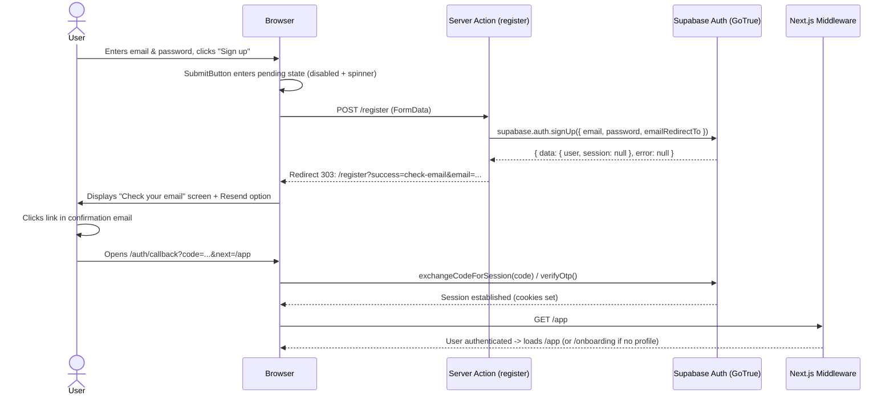

# SIGNUP FIX IMPLEMENTATION REPORT

**Project:** Campus Messenger  
**Date:** 2026-09-30  
**Target Remote Supabase Project:** `wvcfihmgbofypwfxdkry`  
**Status:** Complete & Verified  

---

## 1. Root Cause Summary

From the diagnostic in `docs/SIGNUP_RATE_LIMIT_AUDIT.md`:
1. **Unprotected Submit Button:** The signup form submit button had no pending/disabled state. Users clicking "Sign up" experienced a 1–3 second delay while Supabase processed signup and SMTP email delivery. Rapid clicks or double-clicks triggered concurrent POST requests to the server action.
2. **Missing Email Confirmation Handling:** Remote Supabase project `wvcfihmgbofypwfxdkry` has "Confirm email" enabled by default. Consequently, `supabase.auth.signUp()` returns `data.session === null` until the user confirms their email.
3. **Flawed Post-Signup Navigation:** The previous `register()` action assumed an immediate authenticated session and redirected to `/app`. Next.js middleware detected no session cookie and redirected the user to `/login`, leaving the user confused and prompting them to re-enter their details and click "Sign up" again.
4. **Triggering Supabase Email Cooldown:** Calling `signUp()` repeatedly for the same unconfirmed email triggered Supabase GoTrue's 60-second anti-abuse cooldown (`over_email_send_rate_limit`), returning: `"For security purposes, you can only request this after X seconds."`
5. **Raw Error Leakage in URL:** The server action dumped raw GoTrue error messages into URL query parameters (`/register?error=...`), displaying unformatted internal server messages in the UI.

---

## 2. Files Changed

### 1. `src/components/auth/SubmitButton.tsx` (New Component)
- Implemented a reusable client component leveraging React's `useFormStatus()`.
- Automatically disables the button while an action is pending (`disabled={pending || disabled}`).
- Renders an animated loading spinner (`Loader2`) alongside customizable pending text (e.g. `"Creating account..."`, `"Sending..."`).
- Restores regular button state and text when the action is idle.
- Eliminates concurrent/duplicate form submissions on the client side without ad-hoc workarounds.

### 2. `src/app/auth/actions.ts` (Updated)
- **Email Redirect URL:** Supplied `options.emailRedirectTo: `${origin}/auth/callback?next=/app`` to `supabase.auth.signUp()` and `supabase.auth.resend()`.
- **Payload Inspection:** Captured both `data` and `error` from `supabase.auth.signUp()`.
- **Enumeration / Existing User Detection:** Checked `data?.user && Array.isArray(data.user.identities) && data.user.identities.length === 0` to inform existing users to sign in.
- **Session Resolution:**
  - If `data.session` exists (immediate authentication / auto-confirm enabled): revalidates path and redirects to `/app`.
  - If `data.session === null` (email confirmation required): redirects to `/register?success=check-email&email=${encodeURIComponent(email)}`.
- **Resend Action:** Added `resendConfirmationEmail(formData)` using `supabase.auth.resend({ type: 'signup', email, ... })`.
- **Friendly Rate-Limit Mapping:** Implemented `formatAuthError(error)` to extract seconds from `"For security purposes, you can only request this after X seconds."` and output a clean, friendly message: `"Please wait X seconds before requesting another confirmation email."`

### 3. `src/app/register/page.tsx` (Updated)
- Handled `searchParams.success === 'check-email'`.
- Rendered a dedicated "Check your email" confirmation screen:
  - Header: `"Check your email"` with an email envelope icon.
  - Description: `"Your account was created. We sent a confirmation link to your email address. Confirm your email before signing in."`
  - Safe email badge displaying the registered address.
  - Controlled "Resend confirmation email" form using `<SubmitButton variant="outline" pendingText="Sending...">`.
  - Link returning to `/login` ("Back to Sign in").
- Replaced raw submit button with `<SubmitButton className="w-full" pendingText="Creating account...">Sign up</SubmitButton>`.
- Replaced Google button with `<SubmitButton variant="outline" className="w-full" pendingText="Connecting to Google...">Google</SubmitButton>`.

### 4. `src/app/auth/callback/route.ts` (Updated)
- Maintained PKCE code exchange (`supabase.auth.exchangeCodeForSession(code)`).
- Added support for OTP token hash verification (`supabase.auth.verifyOtp({ type, token_hash })`).
- Ensures compatibility with all Supabase email confirmation link formats (PKCE code or verify token hash).
- Successfully establishes the session in cookies and redirects to the intended destination (`next ?? '/app'`).

---

## 3. New Signup Flow



---

## 4. Email Confirmation & Rate-Limit Handling

- **Email Confirmation:** When `data.session === null`, the application cleanly isolates the user on the confirmation card rather than redirecting to protected routes.
- **Double-Click Mitigation:** `useFormStatus` locks `<SubmitButton>` upon the first click, preventing duplicate POST requests.
- **Rate-Limit Grace:** If a user repeatedly triggers resend or attempts registration within the 60-second window, GoTrue's 429 response is parsed by `formatAuthError()`, presenting:
  > *"Please wait [X] seconds before requesting another confirmation email."*
- **Database Schema & Migrations:** Untouched. No migrations were created or modified.

---

## 5. Verification & Build Results

### Linter:
```bash
npm run lint
```
**Result:** Exit Code 0 (0 errors).

### Build:
```bash
npm run build
```
**Result:** Exit Code 0.
- All 16 routes compiled and optimized successfully.
- `/register` generated dynamic server-rendered page (`ƒ /register`).
- `/auth/callback` generated dynamic route handler (`ƒ /auth/callback`).

---

SIGNUP FLOW FIXED
